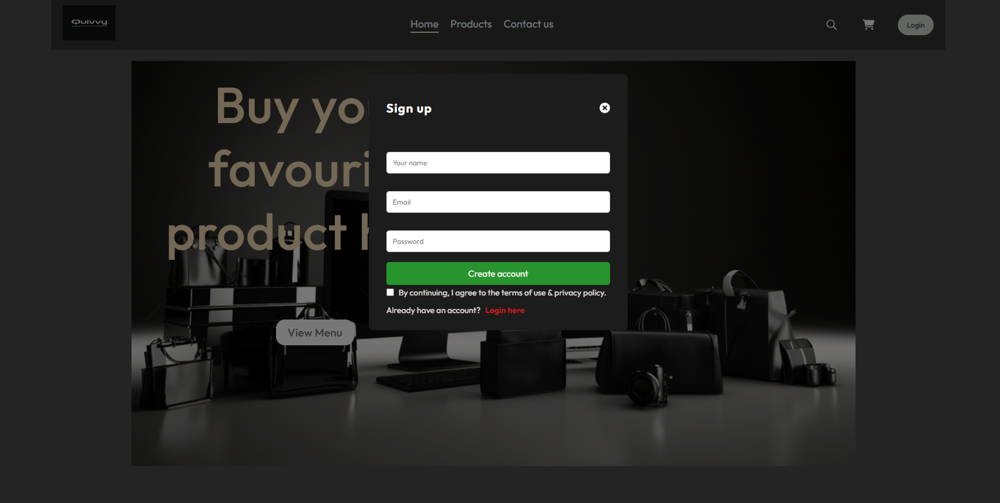
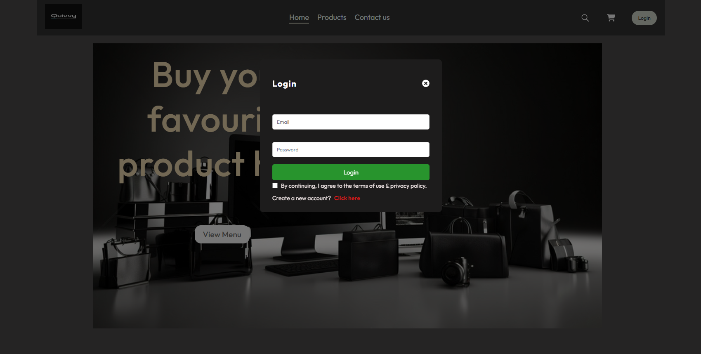
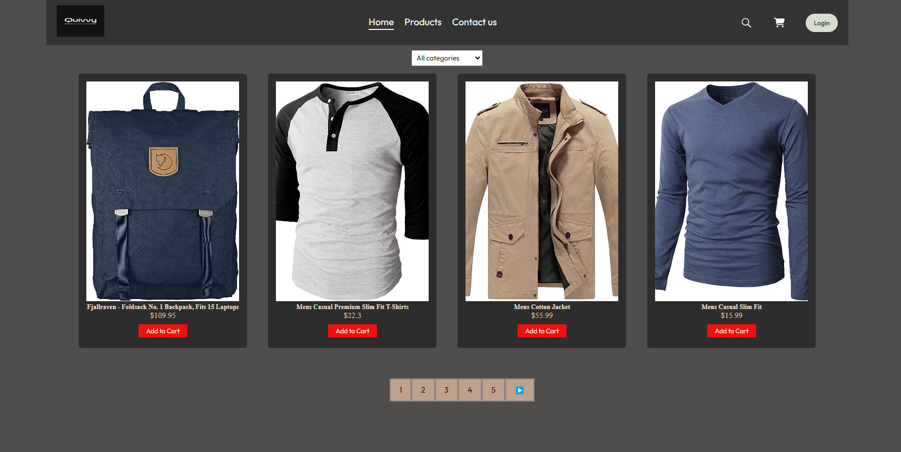
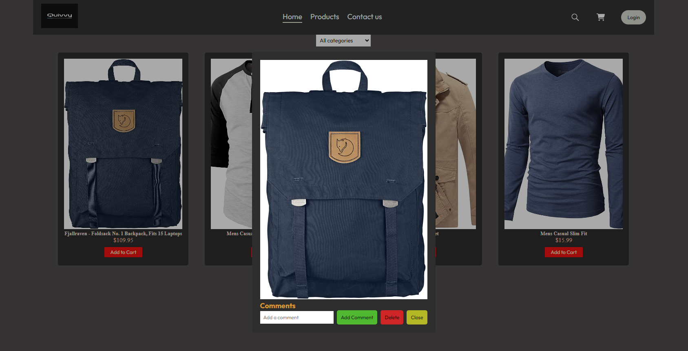
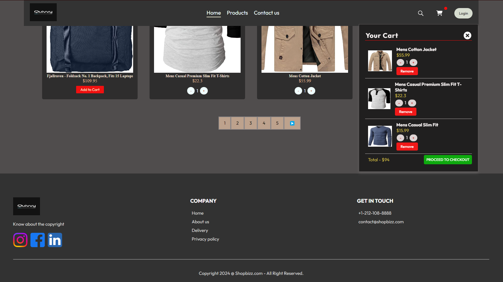
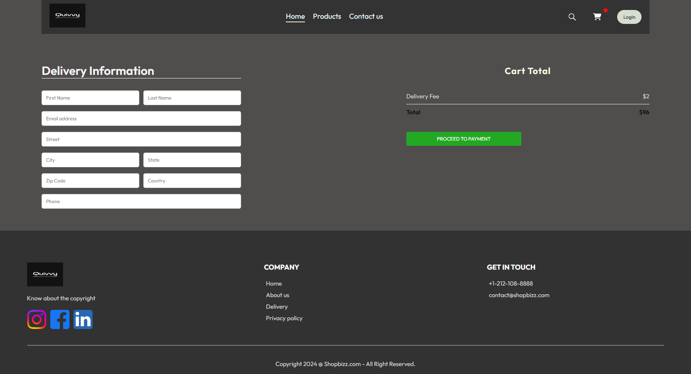

# React E-commerce Shopping 🛒 Application

This project is a React-based e-commerce application that showcases a list of products from the [FakeStore API](https://fakestoreapi.com/). It includes features such as product listing, pagination, modal display for product details, categories, and a cart system with Redux for state management. The application also includes user authentication with signup and login functionality.

## Features

- **User Authentication**: Signup and login functionality.
- **Product Listing**: Displays products fetched from the FakeStore API.
- **Pagination**: Enables navigation through product pages.
- **Modal**: Displays product details in a modal.
- **Categories**: Filters products based on categories.
- **Cart System**: Adds products to the cart and manages the cart using Redux.
- **Responsive Design**: Responsive layout for different screen sizes.

## Getting Started

- Finished the Frontend part
- Working on the Backend functionalities

### Prerequisites

- Node.js (v14 or higher)
- npm (v6 or higher)

### Installation

1. Clone the repository:

   ```sh
   git clone https://github.com/your-username/react-ecommerce-app.git

   ```

2. Navigate to the project directory:
   cd react-ecommerce-app

3. Install the dependencies:
   npm install

### Running the Application

1. Start the development server:
   npm start

2. Open your browser and go to `http://localhost:3000`.

## Usage

### User Authentication

- **Signup**: Users can create an account by providing their details on the signup page.
  

- **Login**: Users can log in using their credentials.
  

### Product Listing

- The home page displays a list of products fetched from the FakeStore API.

- Products are displayed in a flex layout with pagination controls at the bottom.
  

### Categories

- Users can filter products by categories using the dropdown menu on the home page.

### Modal

- Clicking on a product opens a modal displaying the product details.
- The modal includes functionalities of adding comments, deleting product.
  

### Cart System

- Users can add products to their cart through product cards.
- The cart is managed using Redux, ensuring state persistence across the application.
- Clicking the cart icon opens a dropdown with the list of added products and options to increase or decrease quantities or remove items.
  

### Checkout Page

- After adding products in the cart, added page to place the order.
- User will fill his/her details and confirm the order purchase.
  

### Responsive Design

- The application layout adjusts for different screen sizes, providing a good user experience on both desktop and mobile devices.

### Contributing 💻

1. Fork the repository.
2. Create your feature branch: git checkout -b feature/my-new-feature.
3. Commit your changes: git commit -m 'Add some feature'.
4. Push to the branch: `git push origin feature/my-new-feature`.
5. Submit a pull request.

### Acknowledgments

- **FakeStore API** for providing the product data.
- **React Toastify** for toast notifications.

## Contact ✍

For any inquiries or feedback, please contact [bhattkapil.777@gmail.com].
